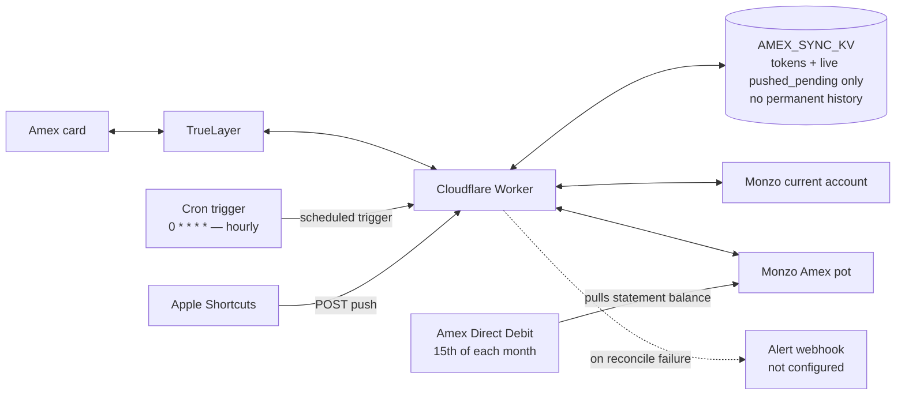

# Amex → Monzo pot reconcile

Cloudflare Worker that, on a cron schedule, reads the balance owed on an
Amex card (via TrueLayer) and the balance of a Monzo pot, and moves the
difference so the pot always mirrors what's owed on Amex — for
budgeting (money already earmarked for the Amex bill sits visibly ring-fenced, not mixed into spendable balance).

> If you're the maintainer working locally: check your own
> `NEXT_STEPS.md` first — it's a live, personal runbook (current cron
> on/off state, open test items, anything mid-flight) that's
> deliberately gitignored and not part of this repo, since it tends to
> accumulate account-specific details. This file is the stable
> architecture/setup reference and changes rarely.

## System design



The cron trigger, not the Shortcut, is what normally drives a
reconcile — it fires hourly regardless of user action. The Shortcut
POST is a fast-path: it records a push in KV and deposits immediately,
so the pot updates in ~1s instead of waiting for the next cron tick.
Both paths go through the same KV-backed state (OAuth tokens for
TrueLayer/Monzo, plus the `pushed_pending` records used to avoid
double-funding a push once TrueLayer's own feed catches up) — nothing
here is a permanent transaction log, see KV keys below.

The Monzo side is two distinct places, not one: the **current
account** (spendable balance) and the **Amex pot** (ring-fenced,
excluded from spendable balance). `movePotFunds` moves money between
them. The Amex direct debit pulls the statement balance directly from
the **pot** (confirmed — not the current account), which is why the
design works at all; if it instead pulled from the current account,
the ring-fenced pot money would be unreachable to it. There's a known
settlement-lag artifact around each DD: the DD reduces the pot
instantly, but TrueLayer's `current` balance doesn't reflect the Amex
payment until it settles, so the Worker briefly sees a stale high
target and refunds the pot from the current account, then withdraws it
straight back out once `current` catches up — self-correcting, but
worth drawing as a note near that edge if useful, not a fourth node.

## Model

**Target-balance reconcile, not per-transaction.** Each run computes:

```
target = max(0, posted_owed + pending_debit − pending_credit + unmatched_pushes)
move   = target − pot_balance      (deposit if +, withdraw if −)
```

Self-correcting: refunds, paying the Amex bill, a missed run and FX
adjustments all wash out on the next run. No cursor, no per-transaction
bookkeeping. Full reasoning for every piece of this is in the header
comment of `src/index.ts` — treat that as the source of truth if this
doc and the code ever disagree.

- **posted_owed** — TrueLayer card balance `current` (settled only).
- **pending** — TrueLayer `/transactions/pending`, so the pot covers
  authorised-but-unsettled Amex spend too.
- **pushes** — spends sent by an iPhone Shortcut (`POST /`) the instant
  they hit Apple Wallet, so the pot updates in ~1s instead of waiting
  for cron job to run every 15 minutes. Each push is dropped once a same-**amount** DEBIT
  shows up in TrueLayer's pending or last-5-days posted data, or after
  5 days (failsafe). Matching is amount-only — two identical amounts
  close together, or an amount that changes on settlement (tip/FX), can
  mis-match and leave the pot off by one transaction until expiry.
  Self-heals; not currently alerted on.

Why this shape: the original design swept individual settled
transactions, but TrueLayer date-stamps Amex transactions at
`00:00:00Z` on the purchase date and they appear in the feed days
later — no moving "since" window ever lines up with them. Rebuilt as a
target-balance reconcile instead, which is immune to that.

## Setup

### 1. Install and log in

```bash
npm install
npx wrangler login
```

### 2. Create the KV namespace

```bash
npx wrangler kv namespace create AMEX_SYNC_KV
```

Copy the returned `id` into `wrangler.toml` under `[[kv_namespaces]]`.

### 3. Register your apps

- **Monzo**: create a *confidential* OAuth client at developers.monzo.com.
  Confidential clients get a refresh_token — required for unattended
  running. Note the `client_id` / `client_secret`.
- **TrueLayer**: in Console, create an app, enable the `cards` and
  `transactions` scopes, and enable `offline_access` (this is what gets
  you a refresh_token). Note the `client_id` / `client_secret`.

### 4. Set secrets

```bash
npx wrangler secret put MONZO_CLIENT_ID
npx wrangler secret put MONZO_CLIENT_SECRET
npx wrangler secret put TRUELAYER_CLIENT_ID
npx wrangler secret put TRUELAYER_CLIENT_SECRET
npx wrangler secret put WORKER_AUTH_SECRET   # any random string you make up
npx wrangler secret put ALERT_WEBHOOK_URL    # optional — Slack/Discord webhook URL
```

`MONZO_ACCOUNT_ID`, `MONZO_POT_ID`, and `TRUELAYER_CARD_ACCOUNT_ID` are
*not* set here — the one-time auth flow below sets those for you
directly. Run each `secret put` above one at a time — pasting several
lines together feeds the next command in as the secret value for the
current one, and run each bare with nothing trailing on the line (see
Gotchas: zsh doesn't treat a trailing `#` as a comment interactively).

### 5. One-time OAuth flow

This only needs doing once per app (and again if you ever revoke
access, or swap which card/account is connected).

```bash
npm run onboard:monzo       # browser approve -> paste code -> approve in Monzo app
npm run onboard:truelayer   # browser approve -> pick Amex -> consent -> paste code
```

`scripts/onboard.mjs` does the code exchange, ID lookup (Monzo
account/pot, TrueLayer card), then offers to **apply the result
directly via `wrangler`** — sets `MONZO_ACCOUNT_ID`/`MONZO_POT_ID` or
`TRUELAYER_CARD_ACCOUNT_ID` and seeds the matching KV token pair itself
(`--remote`, correctly), so nothing needs retyping by hand. Decline the
prompt to get the old printed copy-paste commands instead. Auto-loads
config from `.env.onboard` (gitignored; copy from `.env.example`).

This exists because a manual card swap once set `TRUELAYER_CARD_ACCOUNT_ID`
to a stale value by hand and it silently pointed at the wrong (revoked)
connection until a `?dry=1` check surfaced `404 account_not_found` —
letting the script apply its own output removes that whole class of
mistake.

**The `--remote` flag on `wrangler kv key put/get/list` is required.**
Without it, wrangler v4 writes to a local on-disk KV simulation and the
deployed Worker sees nothing — this cost real debugging time once
already.

Manual-curl fallback for either OAuth exchange, same shape:
```bash
curl -s https://api.monzo.com/oauth2/token -d grant_type=authorization_code -d client_id=CLIENT_ID -d client_secret=CLIENT_SECRET -d redirect_uri=http://localhost:3000/callback -d code=THE_CODE
curl -s https://api.monzo.com/accounts -H "Authorization: Bearer ACCESS_TOKEN"
curl -s "https://api.monzo.com/pots?current_account_id=ACCOUNT_ID" -H "Authorization: Bearer ACCESS_TOKEN"

curl -s https://auth.truelayer.com/connect/token -d grant_type=authorization_code -d client_id=CLIENT_ID -d client_secret=CLIENT_SECRET -d redirect_uri=https://console.truelayer.com/redirect-page -d code=THE_CODE
curl -s https://api.truelayer.com/data/v1/cards -H "Authorization: Bearer ACCESS_TOKEN"
```

### 6. Deploy

```bash
npm run deploy
```

## HTTP interface

All routes require `Authorization: Bearer <WORKER_AUTH_SECRET>`.

| Request | Effect |
|---|---|
| `GET /?dry=1` | Reconcile dry run — returns every figure (`posted_owed_pence`, `pending_debit_pence`, `pending_credit_pence`, `unmatched_push_pence`, `target_pence`, `pot_balance_pence`, `delta_pence`, `action`, `retired_push_ids`, `pending_ok`, `notes`), moves nothing |
| `GET /` | Reconcile now, for real |
| `POST /` `{"amount_pence": 420}` or `{"amount": 4.20}` (optional `"note"`) | Record + immediately deposit a Shortcut push. Rejects ≤0 or >£10,000. De-dupes identical amounts pushed within 90s. |

```bash
curl -s "https://amex-monzo-sync.<sub>.workers.dev/?dry=1" -H "Authorization: Bearer $S"
curl -s -X POST "https://amex-monzo-sync.<sub>.workers.dev/" -H "Authorization: Bearer $S" \
  -H "Content-Type: application/json" -d '{"amount_pence":420,"note":"test"}'
```

Live logs: `wrangler tail --format pretty` (observability is enabled in
`wrangler.toml`; the dashboard's **Logs** tab also retains ~3 days).

## iPhone Shortcut (optional — instant push)

Shortcuts app → **Automation** → **+** → **Create Personal Automation**
→ **Transaction** → pick the Amex card, Amount = Any → Next.

Add action **Get Contents of URL**:

| Field | Value |
|---|---|
| URL | the Worker URL |
| Method | `POST` |
| Headers | `Authorization: Bearer <WORKER_AUTH_SECRET>`, `Content-Type: application/json` |
| Request Body (JSON) | `amount` (Number) = **Transaction Amount** variable, `note` (Text) = **Transaction Merchant** (optional) |

Turn off "Ask Before Running". Only fires reliably for **in-person
tap-to-pay** (a known limitation of the Transaction automation trigger,
not this Worker) — online/in-app Apple Pay spend is still covered, just
by the cron instead of instantly.

Manually running the automation (not a real purchase) sends
`{"amount":0}` — the Transaction Amount variable is only populated by
an actual purchase. Not a bug; don't chase it.

## KV keys

`monzo_tokens`, `truelayer_tokens` (both `{access_token, refresh_token,
expires_at}`), `pushed_pending` (live Shortcut push records), `last_run_iso`
(informational, set on non-dry runs only).

**No permanent transaction history is kept anywhere.** This is
deliberate, not an oversight — it follows from the target-balance
design: everything is recomputed live each run instead of accumulated,
so there's nothing to persist.

- `pushed_pending` holds a push only until it resolves, then it's
  genuinely deleted, not archived — `runReconcile` overwrites the key
  with just the still-unmatched `kept` array once any push retires
  (matched against TrueLayer, or expired after `PUSH_RETIRE_AFTER_MS`).
  There's no separate history/archive collection.
- TrueLayer's pending/posted transaction data is never written to KV
  at all — `fetchAmexTransactions` pulls it fresh from the API every
  run and it only lives in memory for that invocation.
- The only durable record of what happened is Cloudflare's own
  observability Logs (dashboard **Logs** tab), and that's ~3-day
  retention, not permanent — and even within that window it only logs
  aggregate counts (`retired=N`) for successful push matches, not which
  specific push matched which transaction; only expired/unmatched
  pushes get an individual note.

If a permanent audit trail of reconciled spend is ever wanted (e.g. for
budgeting history), that needs new code — nothing here provides it.

## Gotchas

- **`--remote` on every `wrangler kv` command** that touches what the
  Worker reads — see Setup §5.
- **TrueLayer consent expires ~90 days** (PSD2) regardless of use;
  refresh_token itself dies after 30 days unused. Re-run
  `npm run onboard:truelayer` and reseed KV when refresh starts failing
  (`ALERT_WEBHOOK_URL` surfaces this if set).
- **Revoking a TrueLayer connection**: the bank/card issuer's own app is
  the normal path (Settings → manage connected apps → revoke). If
  that's not available, the actual API endpoint is
  `DELETE https://auth.truelayer.com/api/delete` with
  `Authorization: Bearer <that connection's access_token>` — **not**
  `DELETE /data/v1/me` (404s; that's just connection metadata, GET
  only). Verify revocation by attempting a token refresh afterwards —
  it should fail with `invalid_grant`. `GET /me`'s `consent_status` can
  keep showing `Authorised` even after a successful revoke; it's a
  stale metadata view, not the real state.
- **Idempotent by construction**: every run re-derives `target` from
  live balances + records, so a missed run, a failed transfer, or a
  double-fire self-corrects on the next run.
- Run one `wrangler secret put NAME` at a time — pasting several
  commands together feeds the next line in as the current secret's
  value.
- **Run `wrangler secret put NAME` bare, with nothing trailing on the
  same line** — zsh (the default here) does not treat a trailing `#
  comment` as a comment in an interactive shell the way bash does, so
  anything after `#` gets parsed as extra CLI arguments and fails with
  "unknown argument". `scripts/onboard.mjs` prints the command and the
  value to paste on separate lines for this reason — always run the
  command alone, then paste the value only when the interactive prompt
  asks for it.
- `wrangler` is a local devDependency, not a global command — always
  `npx wrangler ...` or `npm run <script>`.
