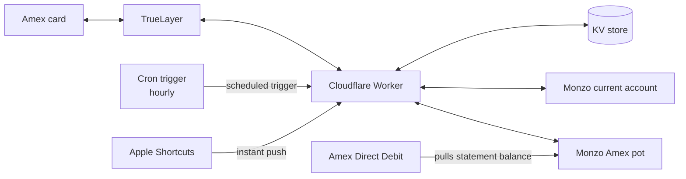

# Amex → Monzo pot reconcile

A Cloudflare Worker that keeps a Monzo pot topped up to match exactly
what's owed on an Amex card, so the money for the bill is always
visibly set aside — not mixed into spendable balance, not tracked
manually.

Every spend on the card (posted or still pending) gets reflected in
the pot within the hour via a scheduled check, or within seconds if
triggered instantly by an iPhone Shortcut on tap-to-pay. When the bill
gets paid, the pot self-corrects back down — no manual top-ups, no
spreadsheet.

## How it works

- **Target-balance reconcile, not per-transaction.** Each run asks
  "what's owed right now?" (TrueLayer's live card balance + pending
  spend, minus any bill payment that's left Monzo but not landed on the
  card yet) and moves the difference into or out of the pot. No cursor,
  no transaction ledger — self-correcting by construction.
- **Two ways in:** an hourly cron does the heavy lifting; an Apple
  Shortcut triggered by a Wallet tap pushes an instant update so the
  pot updates in ~1 second instead of waiting for the next tick.
- **No permanent transaction history.** Nothing about your spend is
  stored beyond what's needed to avoid double-counting a Shortcut push
  — by design, not by omission.

## Getting started

Prerequisites, setup steps, the HTTP interface, and every real gotcha
hit while building this (a couple of genuinely nasty ones) are all in
[`AGENTS.md`](./AGENTS.md) — written so any coding agent, not just one
in particular, can pick it up and get you to a working deployment on
your own Monzo/TrueLayer accounts.

## Stack

TypeScript, Cloudflare Workers + KV, TrueLayer (Open Banking), Monzo API.
